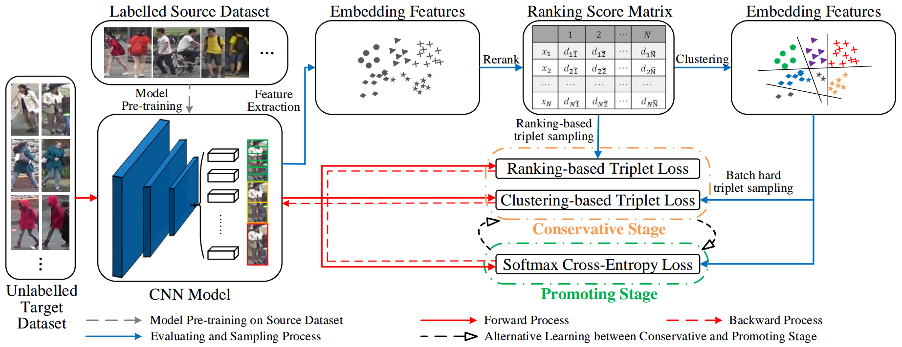

# PAST

Self-Training With Progressive Augmentation for Unsupervised Cross-Domain Person Re-identification (Accepted by ICCV19)

[[PDF]](http://openaccess.thecvf.com/content_ICCV_2019/html/Zhang_Self-Training_With_Progressive_Augmentation_for_Unsupervised_Cross-Domain_Person_Re-Identification_ICCV_2019_paper.html)
[[Project]](https://github.com/zhangxinyu-xyz/PAST-ReID)

**This code is ONLY** released for academic use.

## Pipeline
<div align=center>

</div>

## Installation

- Python 3.6.5 
- Pytorch 0.4.1 
- Torchvision 0.2.1
- Please refer to `requirements.txt` for the other packages with the corresponding versions.

## Preparation
1. Run `git clone https://github.com/zhangxinyu-xyz/PAST-ReID.git`
2. Prepare dataset

    a. Download datasets: [Market-1501](https://drive.google.com/open?id=1EpgASQKU0RQWt3JdJ3h4WTYGBrTV9E1w), [DukeMTMC-reID](https://drive.google.com/open?id=1K-2uVsLB-96EiTo44oyQCyfy20g0uTNO), [CUHK03](https://drive.google.com/open?id=1I3g_FBGOYZHmJYQyOT-4VK6-xAWVKxCw)

    b. Move them to ```$PAST/data/```

    c. Insure the data folder like the following structure (otherwise you should modify the data path in ```~/reid/datasets/[DATANAME].py```):
```
$PAST/data
    Market-1501-v15.09.15
        bounding_box_train
        bounding_box_test
        query
    DukeMTMC-reID
        bounding_box_train
        bounding_box_test
        query
    cuhk03-np
        detected
            bounding_box_train
            bounding_box_test
            query
```
3. Prepare initial files

    a. Download initial model: [source-M.pth.tar](https://drive.google.com/open?id=1xq8AYK3YNlUAbpCjW_3qqggEe1brLyWS) (trained on Market-1501), [source-D.pth.tar](https://drive.google.com/open?id=1QsmaURPjLeU8RCBohCMKs9bMZ1sQdfwC) (trained on DukeMTMC-reID). Move them to ```$PAST/initialization/pretrained_model/```

    b. Download initial feature: [D-M_M-t-feature.mat](https://drive.google.com/open?id=1qx98CdEeHeF1s5JgC0jcrfwa4u78Q3r1) (directly transfer from DukeMTMC-reID to Market-1501), [M-D_D-t-feature.mat](https://drive.google.com/open?id=1JOJlanxla8mZ5koM21J83t-46qll6X43) (directly transfer from Market-1501 to DukeMTMC-reID). Move them to ```$PAST/initialization/initial_feature/```

    c. Download initial distmat: [D-M_M-t-rerank-distmat.mat](https://drive.google.com/open?id=1xTkFQvHg0DvYtvFKTJQggfIyQVXMQP1f) (directly transfer from DukeMTMC-reID to Market-1501, after re-rank), [M-D_D-t-rerank-distmat.mat](https://drive.google.com/open?id=13xV6K0nZzhkWWnD-Z0yHfc3fVHKu9SOK) (directly transfer from Market-1501 to DukeMTMC-reID, after re-rank). Move them to ```$PAST/initialization/initial_distmat/```

    d. If you just want to test our method, you can download our model: [D-M_best-model.pth.tar](https://drive.google.com/open?id=1fPPSh-s8r--715fsGfiSHJgTcdLzZZw3) (transfer from DukeMTMC-reID to Market-1501), [M-D_best-model.pth.tar](https://drive.google.com/open?id=1LfvWG6EeoTDasW-GrGAT9fNJTw1DmEkE) (transfer from Market-1501 to DukeMTMC-reID). Move them to ```$PAST/best_model/```

## Train
You can directly run `train_*.sh ` file for the transferring training process.

```
sh train_D2M.sh  ### from Duke to Market1501
sh train_M2D.sh  ### from Market1501 to Duke
```

You can also modify the `s_name` and `name` with the corresponding initial files to run other transferring processes.

With **Pytorch 0.4.1**, we shall get about 78.0%/54.0% rank-1/mAP on Market-1501 (from DukeMTMC-reID to Market-1501) and 72.0%/54.0% rank-1/mAP on DukeMTMC-reID (from Market-1501 to DukeMTMC-reID).

Note that we use **2 GPUs**.

## Test
You can simply run `test_*.sh ` file for the transferring testing process.

```
sh test_D2M.sh  ### from Duke to Market1501
sh test_M2D.sh  ### from Market1501 to Duke
```
We shall get about **78.38%/54.62%** rank-1/mAP on Market-1501 (from DukeMTMC-reID to Market-1501) and **72.35%/54.26%** rank-1/mAP on DukeMTMC-reID (from Market-1501 to DukeMTMC-reID).

## Results (rank1/mAP)
| Model | M-->D | D-->M | C-->M | C-->D |
| --- | -- | -- | -- | -- |
| PCB (Direct Transfer) | 42.73(25.70) | 57.57(29.01) | 51.43(27.28) | 29.40(16.72) |
| PCB-R (+Re-rank) | 49.69(39.38) | 59.74(41.93) | 55.91(38.95) | 35.19(26.89) |
| PCB-R-CTL+RTL (+Conservative Stage) | 71.63(52.05) | 74.26(50.59) | 77.70(54.36) | 65.71(46.58) |
| PCB-R-PAST (+Promoting Stage) | 72.35(54.26) | 78.38(54.62) | 79.48(57.34) | 69.88(51.79) |

## References
[1] Our code is conducted based on [PCB_RPP_for_reID](https://github.com/syfafterzy/PCB_RPP_for_reID).

[2] [Beyond Part Models: Person Retrievalwith Refined Part Pooling(and A Strong Convolutional Baseline)](http://openaccess.thecvf.com/content_ECCV_2018/papers/Yifan_Sun_Beyond_Part_Models_ECCV_2018_paper.pdf), ECCV2018

[3] [Self-training With progressive augmentation for unsupervised cross-domain person re-identification](https://arxiv.org/abs/1907.13315), ICCV2019

## Citation

If you find this code useful in your research, please kindly consider citing our paper:

    @inproceedings{zhang2019self,
    title={Self-training with progressive augmentation for unsupervised cross-domain person re-identification},
    author={Zhang, Xinyu and Cao, Jiewei and Shen, Chunhua and You, Mingyu},
    booktitle={Proceedings of the IEEE International Conference on Computer Vision},
    pages={8222--8231},
    year={2019}
    }

## Contact

If you have any questions, please do not hesitate to contact us.

[Chunhua Shen](https://cs.adelaide.edu.au/~chhshen/)

[Xinyu Zhang](https://github.com/zhangxinyu-xyz)

